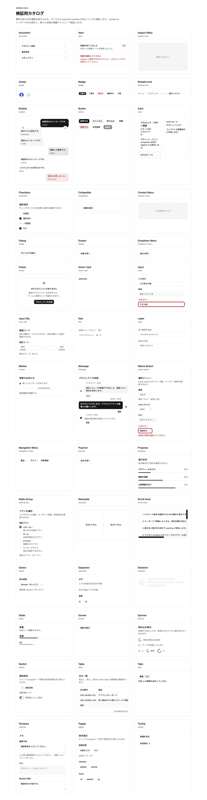
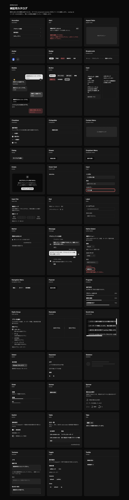

# 動作検証レポート: Task 16 バッチ末尾 catalog 横断検証

## 結論

✅ **実測確認。Task 16 の catalog 横断検証基準をすべて満たした。**

- 製品実装固定 SHA: `e22d241c8b64fc94a0b087081bc1b1ca10c407cf`
- 検証時 HEAD: `9d80b466c754277306f730ba114d091970e86ad7`
- `e22d241c..HEAD` 間で製品実装対象パスの差分は 0 件。
- fresh `npm run build`: exit `0`
- `src/previews/*.tsx` から機械導出した期待集合: 42 件（0件 guard 通過）
- Light / Dark の hydration 後 catalog DOM: 各42 section
- 期待集合との差分: Light / Dark とも欠落0、余剰0
- 正の幅・高さを持つ可視section: Light / Dark とも42/42
- 今回の12件は Light / Dark とも before/after sentinel 0
- Portal 8件は Light / Dark とも Portal content / overlay 0
- Accordion / Collapsible は閉状態
- Scroll Area / Resizable は全必須slotが正の矩形を持って静的表示
- console error / warning: Light / Dark とも0
- full-page JPEG 2件はChrome取得bytesを無変換で保存し、JFIF magic、拡張子、寸法を検査済み
- Chromeタブとpreview serverは終了済み
- 不具合、flaky、仕様矛盾: なし

## 実行環境（再現性の前提）

- 検証日時: 2026-08-02 02:26〜02:34 JST
- repository: `/Users/nishikawa/projects/elchika-inc/ui`
- 開始HEAD: `9d80b466c754277306f730ba114d091970e86ad7`
- 終了HEAD: `9d80b466c754277306f730ba114d091970e86ad7`
- 製品実装固定SHA: `e22d241c8b64fc94a0b087081bc1b1ca10c407cf`
- `9d80b466` の親: `e22d241c`
- OS: macOS 26.3.1（Build `25D2128`）、Darwin 25.3.0 arm64
- Node.js: `v26.4.0`
- npm: `11.17.0`
- Astro preview: `7.1.6`
- Chrome実ブラウザ: Chrome extension 接続
- Chrome実行バイナリ確認値: `Google Chrome 150.0.7871.187`
- 配信host / port: `127.0.0.1:4317`
- Light URL: `http://127.0.0.1:4317/catalog/`
- Dark URL: `http://127.0.0.1:4317/catalog-dark/`
- 実行可否: ✅実行した
- 開始worktree: clean
- fresh build直後worktree: clean
- 終了worktree: 意図的に作成したJPEG 2件のみuntracked

Chrome内部バージョン画面はブラウザ安全ポリシーにより参照できなかったため、上記Chrome版はローカル実行バイナリの `--version` 出力を記録した。

## 成功基準（rubric・実行前に定義）

1. `src/previews/*.tsx` の通常ファイル名から期待component集合を機械導出し、0件なら失敗する。
2. hydration後の `[data-catalog-preview]` 集合が期待集合と完全一致し、欠落・余剰が0件である。
3. 全sectionの `getBoundingClientRect()` が正の幅・高さを持ち、`display != none`、`visibility` が可視、`opacity > 0` である。
4. `astro-island` が存在し、hydration後に `ssr` 属性が除去されている。
5. Light はルートに `dark` classを持たず、Darkは `dark` classを持つ。背景色・前景色もテーマ間で反転している。
6. 今回の12件それぞれについて、section内の `[data-sentinel="before"]` と `[data-sentinel="after"]` が0件である。
7. Portal 8件について、実装と同じcomponent固有 `data-slot` でcontent / popup / viewport / overlayを検索し、catalogでは0件である。
8. Portal 8件のtriggerについて、`aria-expanded`、`aria-haspopup`、`data-open`、`data-popup-open` の実値をcomponent別に採取し、開状態属性を持たない。
9. Accordion / Collapsible のtriggerが `aria-expanded="false"` で、展開contentが0件である。
10. Scroll Area / Resizableはcomponent実装と同じ `data-slot` が存在し、各必須slotが正の矩形を持つ。
11. Light / Darkともconsole errorが0件で、warningも全件報告する。
12. Chromeの `screenshot({ fullPage: true })` が返したbytesを `.jpg` へ無変換保存し、JPEG/JFIF magic・拡張子・寸法が一致する。
13. Chromeタブ、preview serverを終了し、終了HEADとworktree statusを再確認する。

## 一次情報と期待集合の機械導出

### コード側の生成契約

- `src/catalog/previews.ts` は `import.meta.glob("../previews/*.tsx", { eager: true })` を使用する。
- `src/catalog/preview-manifest.mjs` はpathのbasenameをcomponent名とし、各moduleに関数型の `*Preview` exportがちょうど1件あることを要求し、名前順にsortする。
- `src/catalog/verification-catalog.tsx` は各itemを次の実DOMへ写像する。

```tsx
<section data-catalog-preview={name}>
  <Preview mode="catalog" />
</section>
```

### 実行した0件guard付き導出コマンド

```bash
node -e 'const fs=require("node:fs"); const names=fs.readdirSync("src/previews",{withFileTypes:true}).filter((d)=>d.isFile()&&d.name.endsWith(".tsx")).map((d)=>d.name.slice(0,-4)).sort((a,b)=>a.localeCompare(b)); if(names.length===0){console.error("expected preview set is empty");process.exit(1)}; console.log(JSON.stringify({count:names.length,names},null,2))'
```

- 終了コード: `0`
- 導出件数: `42`
- 0件guard: 通過

### 導出した期待component全名前

1. `accordion`
2. `alert`
3. `aspect-ratio`
4. `avatar`
5. `badge`
6. `breadcrumb`
7. `bubble`
8. `button`
9. `card`
10. `checkbox`
11. `collapsible`
12. `context-menu`
13. `dialog`
14. `drawer`
15. `dropdown-menu`
16. `empty`
17. `hover-card`
18. `input`
19. `input-otp`
20. `kbd`
21. `label`
22. `marker`
23. `message`
24. `native-select`
25. `navigation-menu`
26. `popover`
27. `progress`
28. `radio-group`
29. `resizable`
30. `scroll-area`
31. `select`
32. `separator`
33. `skeleton`
34. `slider`
35. `sonner`
36. `spinner`
37. `switch`
38. `table`
39. `tabs`
40. `textarea`
41. `toggle`
42. `tooltip`

Light / Darkのhydration後DOMから採取・sortした実集合も上記42件と完全一致した。

## テストケースと結果

| # | 動作パターン | 導出元 | 技法 | リスク | 判定 | 再現率 | 実体エビデンス |
|---|---|---|---|---|---|---|---|
| 1 | fresh build | コード・script | 実ビルド | High | ✅実測確認 | 1/1 | `npm run build` exit 0、registry 42 item、Astro 87 pages |
| 2 | 期待集合の0件guard付き機械導出 | コード | 集合導出 | High | ✅実測確認 | 1/1 | 42件、exit 0 |
| 3 | Light DOM集合一致 | コード・画面 | 集合差分 | High | ✅実測確認 | 1/1 | actual 42、missing `[]`、extra `[]` |
| 4 | Dark DOM集合一致 | コード・画面 | 集合差分 | High | ✅実測確認 | 1/1 | actual 42、missing `[]`、extra `[]` |
| 5 | 全sectionの正矩形・可視性 | 画面 | 全件走査 | High | ✅実測確認 | 2 themes/2 | Light 42/42、Dark 42/42、nonVisible `[]` |
| 6 | Astro hydrationとtheme | コード・画面 | 状態確認 | High | ✅実測確認 | 2 themes/2 | island 1、`astro-island[ssr]` 0 |
| 7 | 今回12件のcatalog sentinel 0 | コード・画面 | 全数 | High | ✅実測確認 | 24/24 | 各theme×12件でbefore 0 / after 0 |
| 8 | Portal 8件の閉状態 | コード・画面 | 全数 | High | ✅実測確認 | 16/16 | 各theme×8件でcontent 0 / overlay 0 |
| 9 | Accordion / Collapsible閉状態 | コード・画面 | 状態確認 | High | ✅実測確認 | 4/4 | trigger false、content 0 |
| 10 | Scroll Area / Resizable静的表示 | コード・画面 | 構造・矩形 | Medium | ✅実測確認 | 4/4 | 全必須slotが正矩形 |
| 11 | console error / warning | 画面 | 異常系監視 | High | ✅実測確認 | 2/2 | Light `[]`、Dark `[]` |
| 12 | full-page JPEG実体 | 画面・ファイル | magic/dimension | High | ✅実測確認 | 2/2 | JFIF、1512×5833、画像目視済み |
| 13 | server/browser cleanup、終了integrity | 環境 | 終了ゲート | High | ✅実測確認 | 1/1 | listenerなし、curl接続不可、HEAD不変 |

## Light / Dark のcatalog全体実測値

| 項目 | Light | Dark |
|---|---:|---:|
| URL | `http://127.0.0.1:4317/catalog/` | `http://127.0.0.1:4317/catalog-dark/` |
| title | `検証用カタログ — elchika-inc/ui` | `検証用カタログ Dark — elchika-inc/ui` |
| `document.readyState` | `complete` | `complete` |
| 期待section数 | 42 | 42 |
| 実section数 | 42 | 42 |
| missing | 0 | 0 |
| extra | 0 | 0 |
| 正の幅・高さ | 42/42 | 42/42 |
| 全可視 | 42/42 | 42/42 |
| `astro-island` | 1 | 1 |
| `astro-island[ssr]` | 0 | 0 |
| `html.class` | 空 | `dark` |
| catalog main背景 | `oklch(1 0 0)` | `oklch(0.145 0 0)` |
| catalog main前景 | `oklch(0.145 0 0)` | `oklch(0.985 0 0)` |
| catalog main矩形 | 1512×5833.117px | 1512×5833.117px |
| console error | 0 | 0 |
| console warning | 0 | 0 |

可視判定は、各sectionについて次をすべて満たすこととした。

```js
rect.width > 0 &&
rect.height > 0 &&
computedStyle.display !== "none" &&
computedStyle.visibility !== "hidden" &&
computedStyle.visibility !== "collapse" &&
Number(computedStyle.opacity) > 0
```

## 今回12件のsentinelと静的・閉状態

対象12件:

`accordion`, `collapsible`, `scroll-area`, `resizable`, `context-menu`, `dropdown-menu`, `drawer`, `hover-card`, `navigation-menu`, `popover`, `select`, `tooltip`

| component | Light sentinel before/after | Dark sentinel before/after | catalog実測 |
|---|---:|---:|---|
| `accordion` | 0 / 0 | 0 / 0 | trigger 3件すべて `aria-expanded="false"`、content 0 |
| `collapsible` | 0 / 0 | 0 / 0 | root `data-closed`、trigger `aria-expanded="false"`、content 0 |
| `scroll-area` | 0 / 0 | 0 / 0 | root/viewport/content/scrollbar/thumb/cornerを静的表示 |
| `resizable` | 0 / 0 | 0 / 0 | group 1、panel 2、handle 1を静的表示 |
| `context-menu` | 0 / 0 | 0 / 0 | triggerだけを表示、Portal content 0 |
| `dropdown-menu` | 0 / 0 | 0 / 0 | trigger閉、Portal content 0 |
| `drawer` | 0 / 0 | 0 / 0 | trigger閉、popup/content/viewport/overlay 0 |
| `hover-card` | 0 / 0 | 0 / 0 | link triggerだけを表示、Portal content 0 |
| `navigation-menu` | 0 / 0 | 0 / 0 | trigger 2件とも閉、content/viewport 0 |
| `popover` | 0 / 0 | 0 / 0 | trigger閉、Portal content 0 |
| `select` | 0 / 0 | 0 / 0 | combobox trigger閉、Portal content 0 |
| `tooltip` | 0 / 0 | 0 / 0 | triggerだけを表示、Portal content 0 |

## Portal 8件の実測

実装側 `src/components/ui/*.tsx` に付与されたcomponent固有 `data-slot` を、そのままqueryに使用した。意味から推測した汎用selectorには置き換えていない。

| component | 実際に検索したPortal側slot | Light content/overlay | Dark content/overlay |
|---|---|---:|---:|
| `context-menu` | `context-menu-content`, `context-menu-sub-content`, `context-menu-overlay` | 0 / 0 | 0 / 0 |
| `dropdown-menu` | `dropdown-menu-content`, `dropdown-menu-sub-content`, `dropdown-menu-overlay` | 0 / 0 | 0 / 0 |
| `drawer` | `drawer-content`, `drawer-popup`, `drawer-viewport`, `drawer-overlay` | 0 / 0 | 0 / 0 |
| `hover-card` | `hover-card-content`, `hover-card-overlay` | 0 / 0 | 0 / 0 |
| `navigation-menu` | `navigation-menu-content`, `navigation-menu-viewport`, `navigation-menu-overlay` | 0 / 0 | 0 / 0 |
| `popover` | `popover-content`, `popover-overlay` | 0 / 0 | 0 / 0 |
| `select` | `select-content`, `select-overlay` | 0 / 0 | 0 / 0 |
| `tooltip` | `tooltip-content`, `tooltip-overlay` | 0 / 0 | 0 / 0 |

`overlay` slotを実装しないcomponentについてもcomponent固有selectorの件数が0であることを明示的に確認した。

## Portal triggerのexpanded/open属性実値

Light / Darkで同値だった。`—` は属性が存在しないことを表す。

| component | trigger実DOM | `aria-expanded` | `aria-haspopup` / role | `data-open` | `data-popup-open` | 補足 |
|---|---|---|---|---|---|---|
| `context-menu` | `DIV`×1 | — | — / — | — | — | 右クリック用trigger。118px高の正矩形 |
| `dropdown-menu` | `BUTTON`×1 | `false` | `menu` / — | — | — | 閉状態 |
| `drawer` | `BUTTON`×1 | `false` | `dialog` / — | — | — | `data-base-ui-click-trigger`あり |
| `hover-card` | `A`×1 | — | — / — | — | — | `href="#hover-card-preview"` |
| `navigation-menu` | `BUTTON`×2 | 両方`false` | — / — | — | — | 両方 `data-base-ui-navigation-menu-trigger` あり |
| `popover` | `BUTTON`×1 | `false` | `dialog` / — | — | — | `data-base-ui-click-trigger`あり |
| `select` | `BUTTON`×1 | `false` | `listbox` / `combobox` | — | — | 閉状態 |
| `tooltip` | `BUTTON`×1 | — | — / — | — | — | `aria-describedby="tooltip-preview-content"`、contentは閉状態で未mount |

上記triggerは全件、両themeで正の幅・高さを持ち可視だった。

## Accordion / Collapsibleの閉状態

### Accordion

両themeで同一:

- `[data-slot="accordion"]`: 1件、360.664×130px
- `[data-slot="accordion-trigger"]`: 3件
- trigger寸法: 各326.664×42px
- 全trigger `aria-expanded="false"`
- `[data-slot="accordion-content"]`: 0件
- 判定: ✅catalog modeで全item閉状態

### Collapsible

両themeで同一:

- `[data-slot="collapsible"]`: 1件、360.664×76px
- rootに `data-closed`
- `[data-slot="collapsible-trigger"]`: 1件、326.664×42px
- trigger `aria-expanded="false"`
- `[data-slot="collapsible-content"]`: 0件
- 判定: ✅catalog modeで閉状態

## Scroll Area / Resizableの静的表示

### Scroll Area

両themeで同一:

| slot | 件数 | 実測矩形 |
|---|---:|---|
| `scroll-area` | 1 | 360.664×208px |
| `scroll-area-viewport` | 1 | 360.664×208px |
| `scroll-area-content` | 1 | 672×576px |
| `scroll-area-scrollbar` | 2 | vertical 10×196px、horizontal 348.664×10px |
| `scroll-area-thumb` | 2 | vertical 10×70.094px、horizontal 186.438×10px |
| `scroll-area-corner` | 1 | 10×10px |

viewport実測:

- `clientWidth=359`
- `scrollWidth=672`
- `clientHeight=206`
- `scrollHeight=576`
- `scrollLeft=0`
- `scrollTop=0`
- `data-has-overflow-x`
- `data-has-overflow-y`

縦横ともcontentがviewportを超え、両scrollbar / thumbが静的表示されている。

### Resizable

両themeで同一:

| slot | 件数 | 実測矩形 |
|---|---:|---|
| `resizable-panel-group` | 1 | 360.664×224px |
| `resizable-panel` | 2 | 178.828×222px、178.836×222px |
| `resizable-handle` | 1 | 1×222px |

handle実値:

- `role="separator"`
- `aria-orientation="vertical"`
- `aria-valuemin="25"`
- `aria-valuenow="50"`
- `aria-valuemax="75"`
- `tabindex="0"`

## hydration確認

Light / Darkとも:

- `astro-island`: 1件
- `client="load"`
- `component-export="VerificationCatalog"`
- `astro-island[ssr]`: 0件
- `[data-slot="verification-catalog"]`: 1件
- `document.readyState="complete"`

SSR HTMLの存在だけで合格にせず、hydration後にAstroの `ssr` 属性が除去された実DOMで判定した。

## console確認

Chrome実ブラウザのtab consoleを次で採取した。

```js
await catalogTab.dev.logs({
  levels: ["error", "warning", "warn"],
  limit: 1000,
});
```

結果:

- Light: `[]`
- Dark: `[]`
- error: 0
- warning: 0

## 画像証跡

Chromeの次の操作が返したbytesを、そのまま `.jpg` へ保存した。形式変換は行っていない。

```js
const bytes = await catalogTab.screenshot({ fullPage: true });
await fs.writeFile("<path>.jpg", bytes);
```

| theme | bytes | magic先頭16bytes | `file`判定 | 寸法 | SHA-256 |
|---|---:|---|---|---:|---|
| Light | 458,352 | `ffd8ffe000104a464946000101000001` | JPEG / JFIF 1.01 | 1512×5833 | `189f6319aa319a123061f6ca977e1f7ebf4360f6deed6af38c0ef45140f068c9` |
| Dark | 462,902 | `ffd8ffe000104a464946000101000001` | JPEG / JFIF 1.01 | 1512×5833 | `2b09e4402bb3e9a2168d147ed54d76bb400fb00c37377f139187ce9df248ea72` |

- JPEG SOI: `FFD8`
- APP0 marker: `FFE0`
- identifier: `JFIF`
- 拡張子: `.jpg`
- `sips` format: 両方 `jpeg`
- full-page画像を画像ビューアでも目視し、42sectionがLight / Darkの3列catalogとして最後のTooltipまで記録されていることを確認した。





## 実行した再現手順

### 1. 開始状態

```bash
git rev-parse HEAD
git status --porcelain=v1
git show -s --format='%H%n%P%n%ad%n%s' --date=iso-strict e22d241c8b64fc94a0b087081bc1b1ca10c407cf
git show -s --format='%H%n%P%n%ad%n%s' --date=iso-strict 9d80b466c754277306f730ba114d091970e86ad7
```

観測:

- HEAD `9d80b466c754277306f730ba114d091970e86ad7`
- status出力なし（clean）
- `9d80b466` の親は `e22d241c`

### 2. 期待集合導出

```bash
node -e 'const fs=require("node:fs"); const names=fs.readdirSync("src/previews",{withFileTypes:true}).filter((d)=>d.isFile()&&d.name.endsWith(".tsx")).map((d)=>d.name.slice(0,-4)).sort((a,b)=>a.localeCompare(b)); if(names.length===0){console.error("expected preview set is empty");process.exit(1)}; console.log(JSON.stringify({count:names.length,names},null,2))'
```

### 3. fresh build

```bash
npm run build
```

観測:

- exit `0`
- registry build: 42 item
- Astro build: 87 pages
- `/catalog/index.html`
- `/catalog-dark/index.html`
- build後 `git status --porcelain=v1` は空

### 4. port空き確認と起動

```bash
lsof -nP -iTCP:4317 -sTCP:LISTEN
```

- 起動前exit `1`、LISTENなし

```bash
npm run preview -- --host 127.0.0.1 --port 4317
```

- `astro v7.1.6 ready`
- `http://127.0.0.1:4317/`

### 5. Chrome実ブラウザ操作

1. Chromeに `http://127.0.0.1:4317/catalog/` を開く。
2. `load` 完了を待つ。
3. hydration後に以下を一括採取する。
   - `[data-catalog-preview]` 全件の名前と矩形
   - `astro-island` / `astro-island[ssr]`
   - `html.class`
   - `[data-slot="verification-catalog"]` のcomputed background / color
   - 12section内のsentinel件数
   - component固有 `data-slot` のPortal content / overlay件数
   - triggerの `aria-expanded` / `aria-haspopup` / open属性
   - Accordion / Collapsible / Scroll Area / Resizableのslotと矩形
4. console error / warningを採取する。
5. `screenshot({ fullPage: true })` を取得し、Light JPEGへ保存する。
6. `http://127.0.0.1:4317/catalog-dark/` へ移動し、同じ手順を実行する。
7. Dark JPEGを保存する。

DOM集合判定の核:

```js
const actualNames = [...document.querySelectorAll("[data-catalog-preview]")]
  .map((section) => section.getAttribute("data-catalog-preview"))
  .filter(Boolean)
  .sort((a, b) => a.localeCompare(b));

const missing = expectedNames.filter((name) => !actualNames.includes(name));
const extra = actualNames.filter((name) => !expectedNames.includes(name));
```

sentinel判定:

```js
section.querySelectorAll('[data-sentinel="before"]').length;
section.querySelectorAll('[data-sentinel="after"]').length;
```

Portal判定例:

```js
document.querySelectorAll(
  '[data-slot="drawer-content"],' +
  '[data-slot="drawer-popup"],' +
  '[data-slot="drawer-viewport"]'
).length;

document.querySelectorAll('[data-slot="drawer-overlay"]').length;
```

### 6. 画像実体確認

```bash
file .docs/reviews/batch-overlay-catalog-light.jpg .docs/reviews/batch-overlay-catalog-dark.jpg
xxd -l 16 .docs/reviews/batch-overlay-catalog-light.jpg
xxd -l 16 .docs/reviews/batch-overlay-catalog-dark.jpg
sips -g format -g pixelWidth -g pixelHeight .docs/reviews/batch-overlay-catalog-light.jpg
sips -g format -g pixelWidth -g pixelHeight .docs/reviews/batch-overlay-catalog-dark.jpg
shasum -a 256 .docs/reviews/batch-overlay-catalog-light.jpg .docs/reviews/batch-overlay-catalog-dark.jpg
```

### 7. cleanupと終了確認

Chrome:

```js
await chrome.tabs.finalize({});
```

server:

- preview processへ `Ctrl-C`
- process終了を確認

```bash
lsof -nP -iTCP:4317 -sTCP:LISTEN
curl --max-time 2 --silent --show-error http://127.0.0.1:4317/catalog/
git rev-parse HEAD
git status --porcelain=v1
git diff --exit-code e22d241c8b64fc94a0b087081bc1b1ca10c407cf..HEAD -- src types scripts package.json package-lock.json registry.json provenance.json preview-selectors.json README.md
```

観測:

- `lsof`: exit `1`、LISTENなし
- `curl`: exit `7`、接続不可
- 終了HEAD: `9d80b466c754277306f730ba114d091970e86ad7`
- 製品実装対象pathの `e22d241c..HEAD` diff: exit `0`
- 終了statusは作成したJPEG 2件のみ:

```text
?? .docs/reviews/batch-overlay-catalog-dark.jpg
?? .docs/reviews/batch-overlay-catalog-light.jpg
```

## 三方向導出のクロスチェック結果

### コード

- `src/previews/*.tsx`: 42件
- `src/catalog/previews.ts`: 同globをeager import
- `src/catalog/preview-manifest.mjs`: basename化、Preview export件数guard、sort
- `src/catalog/verification-catalog.tsx`: `[data-catalog-preview={name}]` と `<Preview mode="catalog" />`
- 今回12件のpreviewでは `PreviewSentinel` を使用
- Portal componentのcomponent固有 `data-slot` を全確認

### 画面

- Light: `[data-catalog-preview]` 42件
- Dark: `[data-catalog-preview]` 42件
- 両方ともコード由来期待集合と完全一致
- 42/42 sectionが正矩形・可視
- full-page画像で最後のTooltipまで目視

### 型・manifest契約

- `PreviewProps.mode`: `"isolated" | "catalog"`
- catalogは全previewへ `mode="catalog"` を渡す
- OpenAPI等の外部API schemaは対象に存在しない
- スキーマ方向はTypeScript型とmanifest契約で代替した

### 差分

- コードにあるが画面から到達できないcatalog section: なし
- 画面にあるがコード期待集合にないsection: なし
- 型・manifestにあるがcatalogで扱っていないpreview: なし
- source期待42、Light DOM 42、Dark DOM 42で一致

## 未到達分岐（網羅の穴・機械的な証拠）

今回のTask 16はcatalog modeの静的・閉状態横断検証であり、次の分岐は意図的に未到達:

- 12件の `mode === "isolated"` sentinel描画分岐
- Accordion / Collapsibleのopen分岐
- Portal 8件のopen / close / focus / keyboard / pointer分岐
- Scroll Areaのwheel / keyboard scroll分岐
- Resizableのpointer drag / keyboard resize分岐

これらは各isolated preview検証の対象であり、Task 16ではcatalogで閉じていることを確認した。catalog側の今回対象分岐について未到達sectionは0件。

## 検証中のツール側エラー

製品不具合と誤認しないため、検証手段側の事象を記録する。

- Browser操作層が `networkidle` waitをサポートしなかった。
  - 対応: `load` 完了に切り替え、さらに `document.readyState="complete"`、`astro-island[ssr]=0`、catalog DOM 42件でhydrationを実体確認した。
  - 製品挙動への影響: なし。
  - URISK-046（検証手段が実装と異なる経路を通る偽失敗）を適用。
- Browserの制限付きpage evaluateでは `navigator.userAgent` を取得できなかった。
  - 対応: Chrome実行バイナリの `--version` を環境メタとして採取した。
  - 製品挙動への影響: なし。

## 発見した不具合

なし。

- missing / extra: 0
- non-visible section: 0
- sentinel残留: 0
- Portal content / overlay残留: 0
- theme不一致: 0
- hydration不一致: 0
- console error / warning: 0
- 画像形式不一致: 0
- flaky観測: なし

## 見た範囲

- `src/previews/*.tsx` の全ファイル名
- catalog manifest /型 /描画実装
- 今回12件のpreviewにおけるcatalog/isolated条件
- 今回12件のcomponent実装にある実 `data-slot`
- fresh buildの全出力とexit code
- Light / Darkのhydration後DOM全42section
- 全42sectionの矩形・computed visibility
- 12件のsentinel
- Portal 8件のcontent / overlay / trigger属性
- Accordion / Collapsibleの閉状態
- Scroll Area / Resizableの静的slotと寸法
- console error / warning
- Light / Dark full-page画像の内容、bytes、magic、形式、寸法、hash
- Chromeタブ/server cleanup
- 開始・終了HEAD/worktreeと製品実装path差分

## 見ていない範囲・正直な限界

- isolated previewでの開閉・keyboard・pointer・focus trap・focus returnは今回再実行していない。
- catalog上でPortal triggerを操作してopenさせる検証は、catalog閉状態契約と競合するため実施していない。
- mobile / tabletのresponsive breakpoint別検証は実施していない。
- accessibility tree全体とscreen reader読み上げは実施していない。
- network request一覧は今回の明示基準外で、consoleと実DOMを検証した。
- ブラウザ内部ページを使った実行中Chrome patch版の直接照会は安全ポリシーにより未実施。環境欄にはローカルChrome実行バイナリの版を記録した。
- 正常系は各theme 1回。失敗・揺れがなかったため追加再実行は行っていない。

## クリーンアップ

- 検証用永続データ: 作成なし
- Chrome検証タブ: finalize済み
- preview server: `Ctrl-C` で停止
- port 4317 LISTEN: なし
- HTTP再接続: exit 7で接続不可
- 意図的に保持した成果物:
  - `.docs/reviews/batch-overlay-catalog-light.jpg`
  - `.docs/reviews/batch-overlay-catalog-dark.jpg`
- 削除・外部送信・push・commit: 実施なし

## 申し送り候補

- `.docs/actions/` への登録候補: なし
- brainへの記録候補: なし
