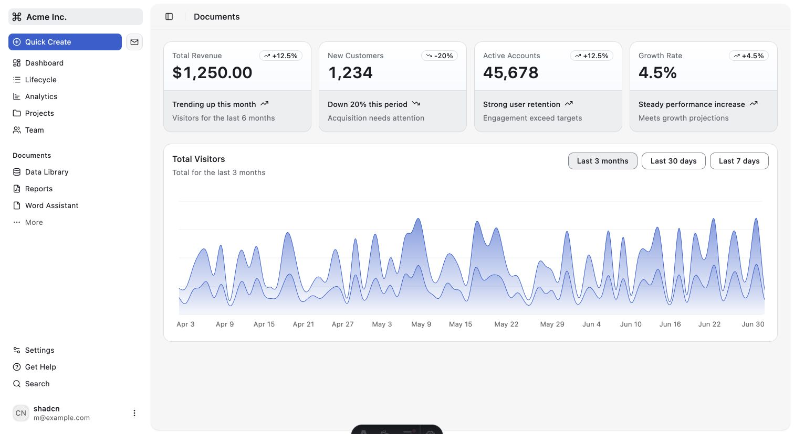
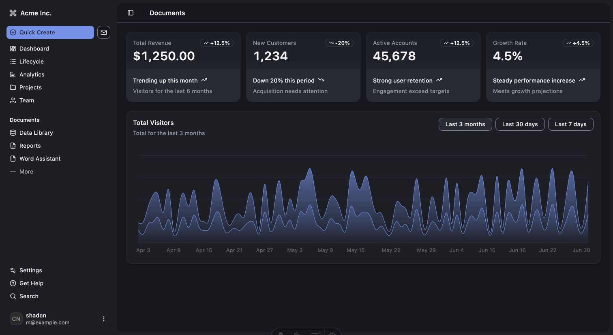
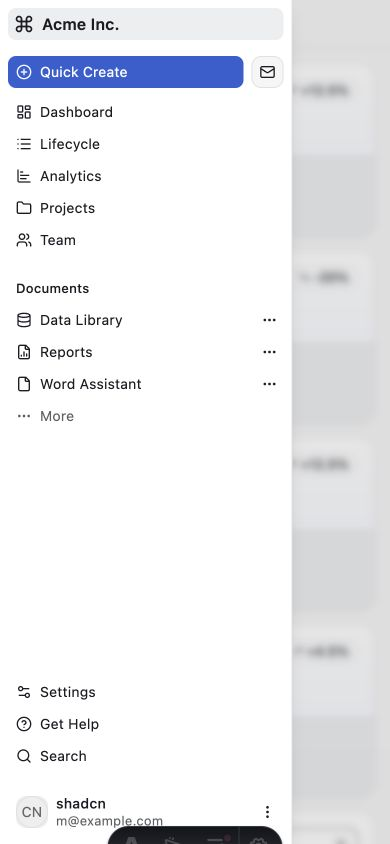
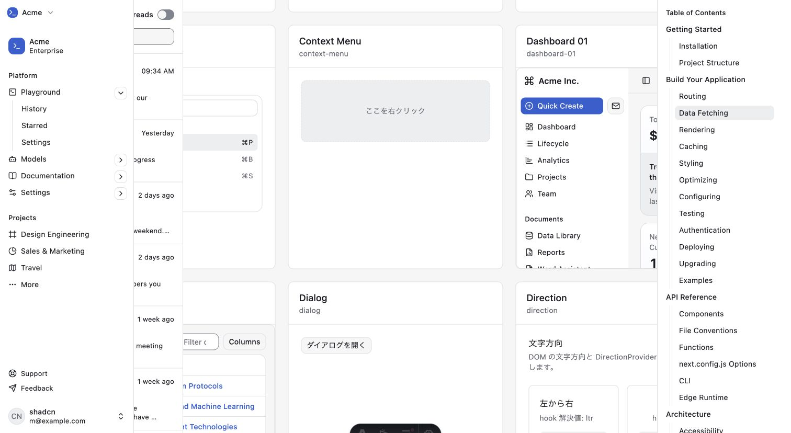

# 動作検証レポート: dashboard-01 preview Acme Inc.・catalog隔離修正後

verified_impl_sha: 71446e87c3fdf3127d3e3e990e9470893fa11990

- 判定: **✅ PASS**
- 対象:
  - `/preview/dashboard-01/`
  - `/preview/dashboard-01-dark/`
  - `/catalog/`
- 実測URL: `http://127.0.0.1:4322`
- desktop viewport: `1512 × 828`
- mobile viewport: `390 × 844`
- ブラウザ: Chrome `151.0.0.0`

## 成功基準

- light / darkで可視exact `Acme Inc.` が1、旧 `Acme` 単独表記が0。
- mobile sidebarで `Acme Inc.` が可視となり、開閉できる。
- catalogのdashboard-01 item内で `Acme Inc.` が実画面上でも可視となる。
- catalog対象spanがitem内にあり、中心点で前面となる。
- dashboard-01 / dashboard-table itemが正寸法。
- isolatedのdesktop offcanvasとmobile動作が退行しない。
- duplicate ID、console error、page exception、HTTP error、request failureが0。
- 全採用監査が`truncated:false`。

## 結果

| ケース | 実測 | 判定 |
|---|---|---|
| light `Acme Inc.` | exact 1、旧exact 0、前面性true | ✅ |
| dark `Acme Inc.` | exact 1、旧exact 0、前面性true | ✅ |
| desktop offcanvas | expanded→collapsed→expanded | ✅ |
| mobile open | dialog 1、sidebar `292.5 × 844`、exact 1 | ✅ |
| mobile close | dialog 0、可視sidebar 0 | ✅ |
| catalog target rect | `{ x:1029.328, y:142.648, width:77.711, height:24 }` | ✅ |
| catalog target item内 | true | ✅ |
| catalog target前面性 | true、front=`SPAN "Acme Inc."` | ✅ |
| catalog sidebar | `position:static`、fixed sidebar-container 0 | ✅ |
| dashboard-01 item | `410.664 × 467` | ✅ |
| dashboard-table item | `410.664 × 467` | ✅ |
| duplicate ID | 全対象0 | ✅ |
| HTTP 4xx/5xx | 0 | ✅ |
| request failure | 0 | ✅ |
| page exception | 0 | ✅ |
| console error | 0 | ✅ |
| event buffer | 全対象`truncated:false` | ✅ |

## isolated offcanvas

初期:

- state: `expanded`
- container: `{ x:0, width:288, right:288 }`
- target前面性: true

collapse後:

- state: `collapsed`
- `data-collapsible="offcanvas"`
- container: `{ x:-256, width:288, right:32 }`
- `Acme Inc.` target x: `-206`

再展開後:

- state: `expanded`
- container: `{ x:0, width:288, right:288 }`
- target前面性: true

catalog修正によるisolated動作の退行はない。

## catalog修正確認

- dashboard-01 item rect: `{ x:985.328, y:47.648, width:410.664, height:467 }`
- dashboard-table item rect: `{ x:116, y:538.648, width:410.664, height:467 }`
- `Acme Inc.` target rect: `{ x:1029.328, y:142.648, width:77.711, height:24 }`
- targetはdashboard-01 item内。
- targetはviewport内。
- `elementFromPoint`はtarget span自身。
- front previewは`dashboard-01`。
- sidebarは`position:static`。
- fixed `sidebar-container`は0。
- 前回のsidebar-10遮蔽は再現しない。

## 通信・実行時エラー

| 対象 | response観測値 | truncated | HTTP error | failure | exception | console error |
|---|---:|---|---:|---:|---:|---:|
| light | 158 | false | 0 | 0 | 0 | 0 |
| dark | 158 | false | 0 | 0 | 0 | 0 |
| mobile | 158 | false | 0 | 0 | 0 | 0 |
| catalog | 421 | false | 0 | 0 | 0 | 0 |

response件数は今回の観測値であり、固定成功条件には使用しない。

## evidence

- `evidence/2026-08-22-dashboard-01-light.jpg`
- `evidence/2026-08-22-dashboard-01-dark.jpg`
- `evidence/case03-dashboard-01-mobile-sidebar-acme-inc.jpg`
- `evidence/case04-catalog-dashboard-items-acme-inc-visible.jpg`
- `evidence/case05-browser-results.json`
- `evidence/case06-network-console-audit.json`
- `evidence/case07-server-cleanup.log`

全4画像のmagic bytesはJPEG JFIF。画像拡張子と実体は一致した。

## 未検証

- dashboard chartの期間切替。
- sidebar内各navigation itemの遷移。
- dashboard-tableの機能操作。
- network offline。
- JavaScript無効。
- catalog全preview間の相互遮蔽。

## クリーンアップ

- 対象server停止済み。
- port 4322のLISTEN残留なし。
- 無関係なport 4321 / PID 11102は継続。
- browser viewportをresetし、検証tabをclose。
- 永続データ変更なし。
- tracked / staged差分なし。
