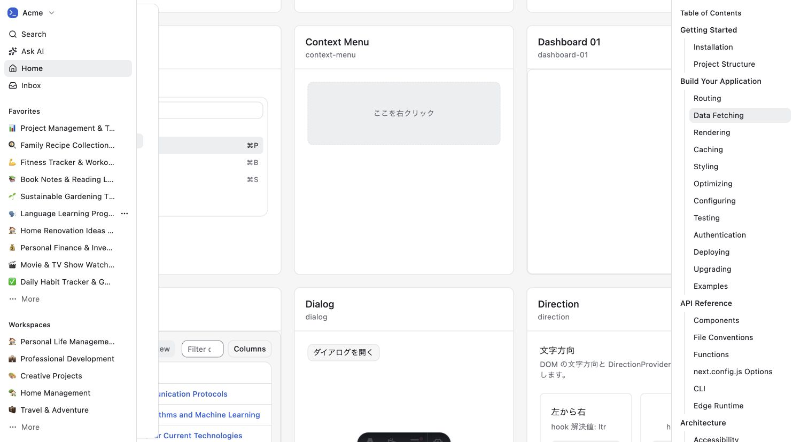

# 動作検証レポート: Acme Inc. 復元の影響再検証

verified_impl_sha: 2c1b6aa70c8e78dffefd5a80a2684ad758da0915

- 総合判定: **❌ FAIL**
- `dashboard-01` のlight / dark / mobileでは、`Acme Inc.` 復元を実画面で確認した。
- catalogのdashboard-01 item内にも `Acme Inc.` はDOM上存在するが、後続sidebar previewのfixed layerに遮蔽され、画面上で可視にならない。
- catalog可視条件を満たさないため、他の条件が合格でも総合判定はFAILとした。

## 実行環境（再現性の前提）

- 検証日時: 2026-08-22 16:38:18–16:53:45 JST
- 対象コミット: 上記 `verified_impl_sha`
- OS: Darwin 25.3.0 / arm64
- Node.js: `v26.7.0`
- npm: `11.19.0`
- ブラウザ: Chrome `151.0.0.0`
- user agent: `Mozilla/5.0 (Macintosh; Intel Mac OS X 10_15_7) AppleWebKit/537.36 (KHTML, like Gecko) Chrome/151.0.0.0 Safari/537.36`
- desktop viewport: `1512 × 828`
- mobile viewport: `390 × 844`
- devicePixelRatio: `2`
- 起動コマンド: `npm run dev -- --host 127.0.0.1 --port 4321`
- 4321は無関係なPID 11102が使用中だったため停止せず、対象Astroが割り当てた `http://127.0.0.1:4322` を使用した。
- 対象Astro PID: `70760`
- 実行可否: ✅実行した

## 成功基準（rubric・実行前に定義）

- `/preview/dashboard-01/` と `/preview/dashboard-01-dark/` で、可視UI textが正確に `Acme Inc.`、旧 `Acme` 単独表記が0。
- 390×844でmobile sidebarを開き、sidebar内の可視UI textが `Acme Inc.`、開閉が動作する。
- `/catalog/` のdashboard-01 item内で `Acme Inc.` が画面上で可視となる。
- catalogのdashboard-01 / dashboard-table itemが正寸法を持つ。
- 各対象の安定描画後にduplicate DOM id、console error、page exception、HTTP 4xx/5xx、request failureが0。
- event bufferの切り捨て有無を記録し、切り捨てられた監査結果をエラー0の根拠にしない。
- light / dark / mobile / catalogの新規スクリーンショットを取得し、拡張子とmagic bytesの一致を確認する。
- 件数は今回の観測値としてのみ記録し、将来の固定成功条件にしない。
- 非変更のdashboard-table機能は再実行しない。

## テストケースと結果

| # | 動作パターン | 導出元 | 技法 | リスク | 判定 | 再現率 | 実体エビデンス | 再現手順 |
|---|---|---|---|---|---|---|---|---|
| 1 | dashboard-01 lightの表記 | コード・画面 | 同値分割 | High | ✅実測確認 | 1/1 | `evidence/case01-dashboard-01-light-acme-inc.jpg`、`evidence/case07-browser-results.json` | `/preview/dashboard-01/` を開き、5000ms安定後に可視text nodeをexact集計 |
| 2 | dashboard-01 darkの表記 | コード・画面 | テーマ同値分割 | High | ✅実測確認 | 1/1 | `evidence/case02-dashboard-01-dark-acme-inc.jpg`、`evidence/case07-browser-results.json` | `/preview/dashboard-01-dark/` を開き、5000ms安定後に同じ集計を実施 |
| 3 | mobile sidebarの開閉と表記 | コード・画面 | 1スイッチ状態遷移 | High | ✅実測確認 | 1/1 | `evidence/case03-dashboard-01-mobile-sidebar-acme-inc.jpg`、`evidence/case07-browser-results.json` | viewportを390×844へ変更し、`サイドバーを切り替える` をクリック後、Escapeで閉じる |
| 4 | catalog dashboard-01 item内のDOM表記 | コード・画面・型 | スコープ限定同値分割 | High | ✅実測確認 | 3/3 | `evidence/case07-browser-results.json` | `[data-catalog-preview="dashboard-01"]` 内だけを対象にexact textを集計 |
| 5 | catalog dashboard-01 item内の実画面可視性 | 画面 | 遮蔽・前面要素監査 | High | ❌不具合 | 2/2 | `evidence/case05-catalog-dashboard-items-acme-inc-visible.jpg`、`evidence/case06-catalog-acme-inc-occluded-final.jpg`、`evidence/case07-browser-results.json` | open中dialogを閉じ、対象itemへscrollし、後続sidebarを通常UIのtoggleで折りたたんだ後、対象中心の`elementFromPoint`を確認 |
| 6 | catalog対象2itemの寸法 | 画面 | 境界値 | High | ✅実測確認 | 3/3 | `evidence/case07-browser-results.json` | dashboard-01 / dashboard-table sectionの`getBoundingClientRect()`を計測 |
| 7 | 安定描画後のduplicate DOM id | 画面 | 否定条件監査 | High | ✅実測確認 | 4対象 | `evidence/case07-browser-results.json` | 各対象の安定描画後に全`[id]`を集計 |
| 8 | HTTP・通信失敗・例外・console error | 画面・通信 | 異常系監査 | High | ✅実測確認 | 4対象 | `evidence/case08-network-console-audit.json` | CDPで対象操作区間を監査。catalogは連続70 batchで回収 |
| 9 | screenshotの画像実体 | 画面 | ファイル形式検査 | Medium | ✅実測確認 | 6/6 | `evidence/case01-dashboard-01-light-acme-inc.jpg`〜`evidence/case06-catalog-acme-inc-occluded-final.jpg` | `file evidence/*.jpg` とmagic bytesを確認 |
| 10 | 対象serverの停止と共有port保全 | CLI | クリーンアップ | High | ✅実測確認 | 1/1 | `evidence/case09-server-cleanup.log` | `astro dev stop`後、4322の`lsof`がexit 1、4321のPID 11102が継続LISTENすることを確認 |

## 主要実測値

### dashboard-01 light

- `Acme Inc.` 可視exact text: 1
- 旧 `Acme` 単独可視exact text: 0
- dashboard root: 1
- root rect: `1512 × 828`
- `Documents` heading: 1
- section card: 5
- chart SVG: 1
- duplicate ID: 0
- スクリーンショット上でも左上の `Acme Inc.` を目視確認。

### dashboard-01 dark

- `Acme Inc.` 可視exact text: 1
- 旧 `Acme` 単独可視exact text: 0
- dashboard root: 1
- root rect: `1512 × 828`
- `Documents` heading: 1
- section card: 5
- chart SVG: 1
- `<html class="dark">`
- duplicate ID: 0
- スクリーンショット上でも左上の `Acme Inc.` を目視確認。

### mobile sidebar

開く前:

- viewport: `390 × 844`
- sidebar trigger: 1
- dialog: 0
- mobile sidebar DOM: 0
- 可視sidebar: 0

開いた後:

- dialog: 1
- sidebar rect: `292.5 × 844`
- `Acme Inc.` 可視exact text: 1
- 旧 `Acme` 単独可視exact text: 0
- duplicate ID: 0
- スクリーンショット上でもsidebar上部の `Acme Inc.` を目視確認。

Escape後:

- dialog: 0
- mobile sidebar DOM: 0
- 可視sidebar: 0

### catalog DOM・item寸法

今回の観測値:

- catalog root: 1
- preview item: 89
- dashboard-01 item: 1
- dashboard-table item: 1
- dashboard-01 rect: `410.664 × 467`
- dashboard-table rect: `410.664 × 467`
- dashboard-01 item内 `Acme Inc.` exact text: 1
- dashboard-01 item内旧 `Acme` 単独exact text: 0
- duplicate ID: 0

上記件数は今回の観測値であり、将来の固定成功条件には使用しない。

### catalog可視性のFAIL実測

open中のSettings dialogを閉じ、dashboard-01 itemへscrollした後も、後続sidebar previewのfixed layerが対象itemを覆った。

通常UI操作で以下を試行した。

1. `Close` buttonでopen中dialogを閉じる。
2. dashboard-01 / dashboard-table itemがviewportへ入る位置までscrollする。
3. `sidebar-16` の `Toggle sidebar` を操作する。
4. `sidebar-15` と、`sidebar-01`〜`sidebar-14`の利用可能なsidebar triggerを操作する。
5. 展開状態を再確認し、展開中sidebarだけを再度toggleする。
6. dashboard-01内の `Acme Inc.` span中心点で`elementFromPoint`を測る。

最終実測:

- dashboard-01 item rect: `{ x: 985.328, y: 47.648, width: 410.664, height: 467 }`
- dashboard-table item rect: `{ x: 116, y: 538.648, width: 410.664, height: 467 }`
- 対象 `Acme Inc.` span rect: `{ x: 50, y: 20, width: 77.711, height: 24 }`
- 対象中心点: `{ x: 88.855, y: 32 }`
- `elementFromPoint`の前面preview: `sidebar-10`
- 前面要素: `BUTTON`
- 前面text: `Acme`
- 前面sidebar state: `expanded`
- 前面sidebar `data-collapsible`: 空文字
- `targetIsFront`: `false`
- dialog: 0
- duplicate ID: 0

`sidebar-10` など非折りたたみsidebarはtoggle後もexpandedのままで、通常UI操作では遮蔽を解消できなかった。対象文字列はDOM上に存在するが、利用者の画面には見えない。

### 通信・実行時エラー監査

合格根拠として採用した監査:

| 対象 | response観測値 | truncated | HTTP 4xx/5xx | request failure | page exception | console error |
|---|---:|---|---:|---:|---:|---:|
| dashboard-01 light | 158 | false | 0 | 0 | 0 | 0 |
| dashboard-01 dark | 158 | false | 0 | 0 | 0 | 0 |
| dashboard-01 mobile | 158 | false | 0 | 0 | 0 | 0 |
| catalog | 423 | false | 0 | 0 | 0 | 0 |

- 総response観測値: `897`
- 総件数は今回の観測値であり、固定成功条件には使用しない。
- dev error log: 全対象0。

catalogでは以下の監査結果を成功根拠から除外した。

- 初回一括回収: `truncated:true`
- 100ms間隔の逐次回収: 集中ロード中の1 batchが`truncated:true`
- 最終再実行: event到着を連続70 batchで回収し、最大batch 98件、`truncated:false`

切り捨てられた2回をエラー0の根拠にせず、最終の切り捨てなし監査だけを採用した。

### screenshot形式

- JPEG: 6
- PNG: 0
- 全6画像が `JPEG image data, JFIF standard 1.01`
- desktop画像: `1512 × 828`
- mobile画像: `390 × 844`
- evidence全体: 9件、484KB

## 三方向導出のクロスチェック結果

### コードから

- `src/blocks/dashboard-01/components/app-sidebar.tsx` のブランド表示は `Acme Inc.`。
- `DashboardZeroOnePreview` はlight / dark / catalogで同じ`AppSidebar`を使用する。
- mobileでは`SidebarTrigger`によりsidebarのopen状態が切り替わる。
- catalogは複数previewを同一ページへ描画する。

### 画面から

- light / dark / mobileではコード上の `Acme Inc.` と実画面表示が一致した。
- catalogではdashboard-01 item内のDOM textはコードと一致したが、同一ページ上の後続fixed sidebarに遮蔽された。
- 「要素が存在する」「rectが正」「画面上で見える」は同値ではなく、catalogでは前2条件のみ成立した。

### 型・スキーマから

- `PreviewProps` の`mode`によりisolated / catalogの表示経路が分かれる。
- 本検証対象にユーザー入力schemaはない。
- catalog modeで同一DOMへ配置されるpreview同士のlayer isolationを保証する型制約はない。

### 乖離

- コードとisolated画面: 一致。
- コードとcatalog DOM: 一致。
- catalog DOMと実画面可視性: 不一致。
- 画面から入力できるがコードで検証していない値: 本件対象内ではなし。
- 型にあるがコードで扱っていないパラメータ: 本件対象内ではなし。

## 未到達分岐（網羅の穴・機械的な証拠）

- dashboard-01 chartの7日・30日・90日切替。
- sidebar内navigation itemの遷移。
- user menu、Quick Create、Inbox等の個別操作。
- network offline、resource timeout、JavaScript無効。
- 全catalog preview間のlayer isolation組み合わせ。
- dashboard-tableのsort / selection / drawer / chartは非変更かつ明示的に再実行不要のため未実行。

## 発見した不具合

### catalog内dashboard-01のブランド表記が後続sidebar previewに遮蔽される

期待:

- catalogのdashboard-01 item内で `Acme Inc.` が画面上に表示される。

実際:

- dashboard-01 item内には `Acme Inc.` がexact 1件存在する。
- 対象spanは正寸法だがfixed配置でitem外の左上へ出ている。
- 同じ場所を後続 `sidebar-10` 等が覆い、対象中心点の`elementFromPoint`は別previewのbuttonを返す。
- 通常UI操作でdialogを閉じ、折りたためるsidebarを閉じても、非collapsible sidebarが残る。
- screenshot上ではdashboard-01 itemのpreview領域が空白に見え、`Acme Inc.` は確認できない。

再現率:

- dialog close後の確認とsidebar toggle後の最終確認で `2/2`。

再現手順:

1. `npm run dev -- --host 127.0.0.1 --port 4321` で起動する。
2. 実際に割り当てられたURLの `/catalog/` を開く。
3. 5000ms待ち、開いているSettings dialogがあれば`Close`を押す。
4. `[data-catalog-preview="dashboard-01"]` がviewportへ入る位置までscrollする。
5. 利用可能な後続sidebar triggerを操作してsidebarを閉じる。
6. dashboard-01 item内の `Acme Inc.` span中心点で`elementFromPoint`を確認する。
7. `sidebar-10`のbuttonが前面となり、対象が見えないことを確認する。

エビデンス:

- `evidence/case06-catalog-acme-inc-occluded-final.jpg`
- `evidence/case07-browser-results.json`

## 検証器側の一過性エラー

Playwright evaluate sandboxでは`NodeFilter`、`document.createTreeWalker`、`navigator`が提供されなかった。URISK-046を適用し、製品コードを変更せず以下へ分離した。

- 可視text: 全要素の直接text node（`nodeType === 3`）を読み取り。
- user agent: CDP `Runtime.evaluate`で読み取り。

これは製品不具合として扱っていない。

## 未列挙・未検証の残（正直な限界）

- catalogの遮蔽が今回のAcme Inc.変更で新規発生したか、既存のcatalog preview isolation不具合かの履歴比較は、本依頼が固定commitの影響ブラウザ再検証に限定されるため未実施。
- catalog内の全sidebarを個別に隔離表示した場合の比較は未実施。
- 遮蔽を解消する実装修正は依頼範囲外のため実施していない。
- dashboard-table機能は明示指示どおり未実行。

## クリーンアップ

- browser viewport overrideをreset。
- 検証用browser tabをclose。
- 対象Astro PID 70760を停止。
- port 4322: `lsof` exit 1、LISTENなし。
- `astro dev status`: `No dev server is running.`、exit 0。
- 無関係なport 4321 / PID 11102は継続LISTEN。
- 検証データ作成なし。
- 外部送信・deploy・既存データ削除なし。
- tracked fileの差分なし。
- staged差分なし。
- 新規 `.docs/reviews/2026-08-22-phase3-acme-recheck/evidence/` 配下だけへ9件保存。
- 既存 `.docs/reviews/2026-08-22-phase3-r3-recheck*/**` は変更していない。

## 申し送り候補

- `.docs/actions/` 登録候補: catalog内でfixed sidebar previewが他itemを遮蔽し、dashboard-01の実画面検証を妨げる問題。
- brain記録候補: 高密度ページのCDP監査は100ms pollingでもbuffer evictionが起こり得るため、event到着待受を連続化し`truncated:false`を合格条件にする。
