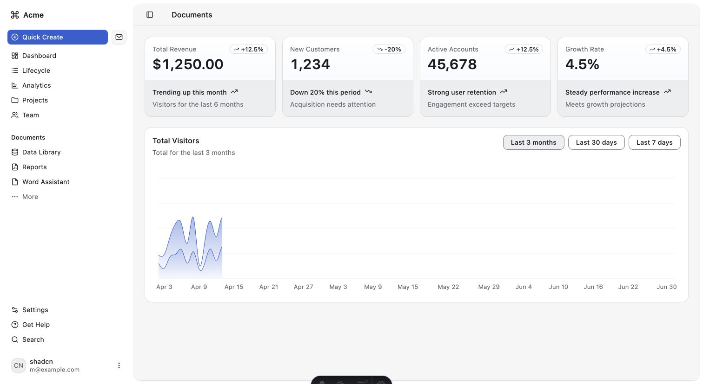
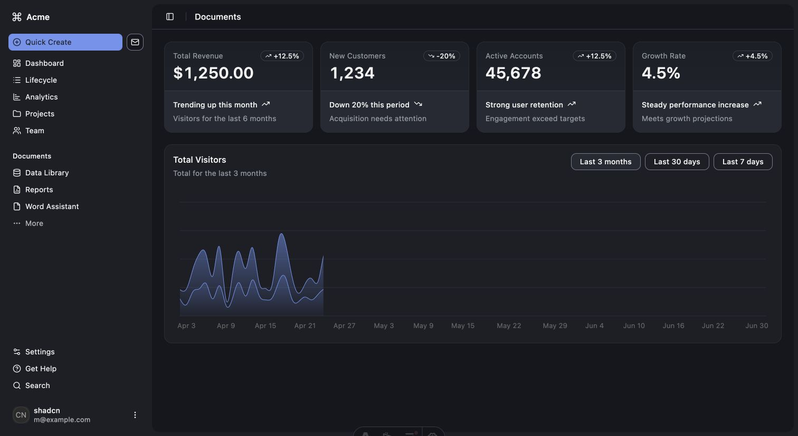
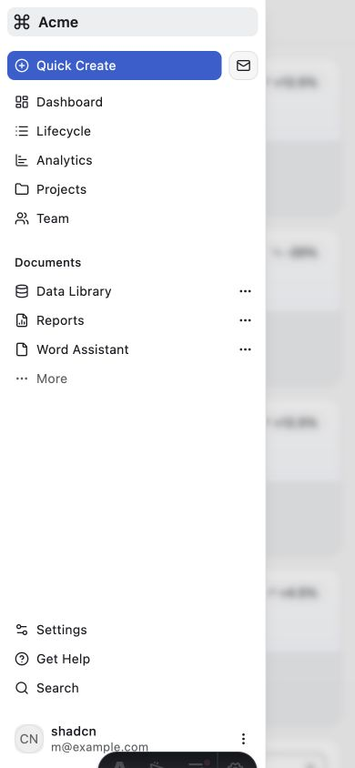
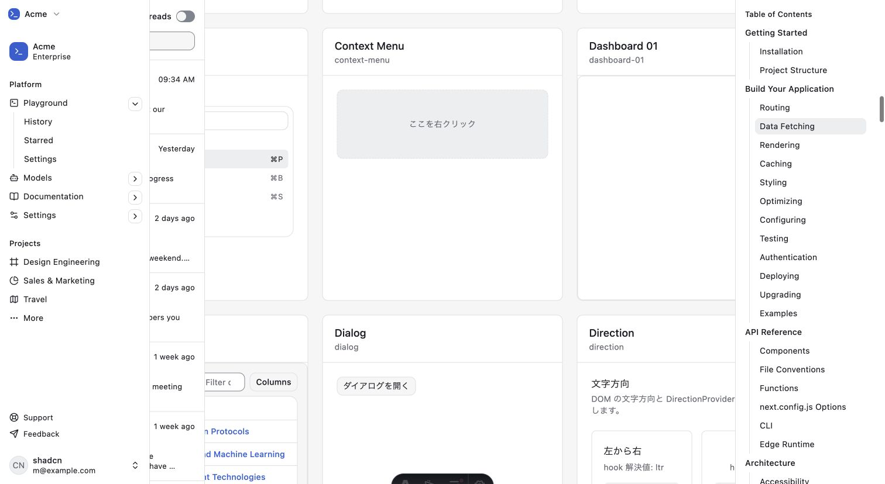

# 動作検証レポート: dashboard-01 preview 修正後再検証

verified_impl_sha: 6441e12efe9e2ca6eaa5a456c93d4d9f0ff00e37

- 判定: **✅ PASS**
- 対象:
  - `/preview/dashboard-01/`
  - `/preview/dashboard-01-dark/`
  - `/catalog/`
- 実測URL: `http://127.0.0.1:4322`
- 通常viewport: `1512 × 828`
- mobile viewport: `390 × 844`
- ブラウザ: Chrome `151.0.0.0`

## 成功基準

- light / darkでdashboard root、heading、cards、chartが描画される。
- mobileでsidebarを開閉できる。
- catalog内にdashboard-01が1件存在し、正寸法を持つ。
- duplicate ID、console error、page exception、HTTP error、request failureが安定描画後に0。

## light / dark結果

| 項目 | light | dark |
|---|---:|---:|
| dashboard root | 1 | 1 |
| `Documents` heading | 1 | 1 |
| `Acme` | 1 | 1 |
| section cards | 5 | 5 |
| chart root | 1 | 1 |
| chart SVG | 1 | 1 |
| root rect | `1512 × 828` | `1512 × 828` |
| duplicate ID | 0 | 0 |

data record countは今回の観測値としてlight / darkとも `68`。固定成功条件には使用しない。

## mobile sidebar

- viewport: `390 × 844`
- open前:
  - sidebar DOM: 0
  - 可視sidebar: 0
- trigger操作後:
  - dialog: 1
  - sidebar: `292.5 × 844`
  - 可視: true
  - duplicate ID: 0
- Escape後:
  - dialog: 0
  - 可視sidebar: 0

## catalog統合

- catalog root: 1
- preview item総数: 今回の観測値 `89`
- dashboard-01 item: 1
- dashboard-table item: 1
- dashboard-01 / dashboard-tableのrectは正。
- 5000ms安定後duplicate ID確認: 2/2で0。

catalog初回3000ms時点では `base-ui-_r1R_52a_` の一時重複を観測したが、追加1000msで解消した。安定確認では再現していない。

## 通信・実行時エラー

| ページ | response観測値 | truncated | HTTP error | request failure | page exception |
|---|---:|---|---:|---:|---:|
| dashboard-01 light | 158 | false | 0 | 0 | 0 |
| dashboard-01 dark | 158 | false | 0 | 0 | 0 |
| catalog | 422 | false | 0 | 0 | 0 |

- catalogは48batchの逐次回収で切り捨てを防止。
- console error: 0

## evidence

- `evidence/2026-08-22-dashboard-01-light.jpg`
- `evidence/2026-08-22-dashboard-01-dark.jpg`
- `evidence/case06-dashboard-01-mobile-sidebar-open.jpg`
- `evidence/case07-catalog-dashboard-items.jpg`
- `evidence/case08-browser-results.json`
- `evidence/case09-network-console-audit.json`

## 未検証

- dashboard chartの7日・30日・90日切替。
- sidebar内各navigation itemの遷移先。
- network offline。
- JavaScript無効。
- catalog hydration中の一時duplicate IDが支援技術へ与える過渡的影響。

## クリーンアップ

- 対象server停止済み。
- port 4322のLISTEN残留なし。
- 永続データ変更なし。
