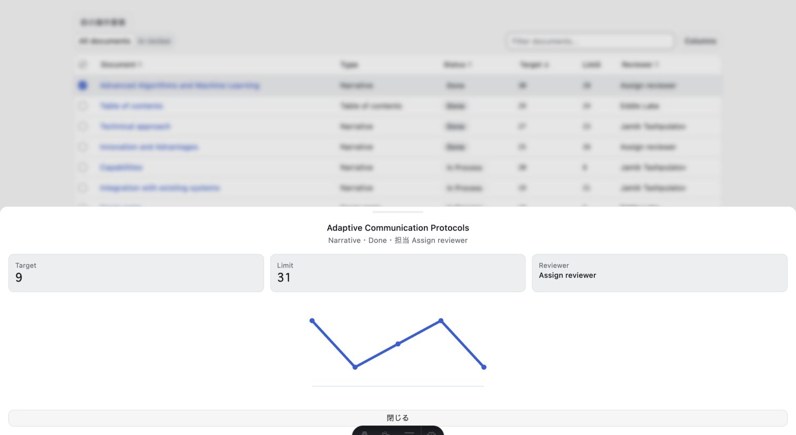
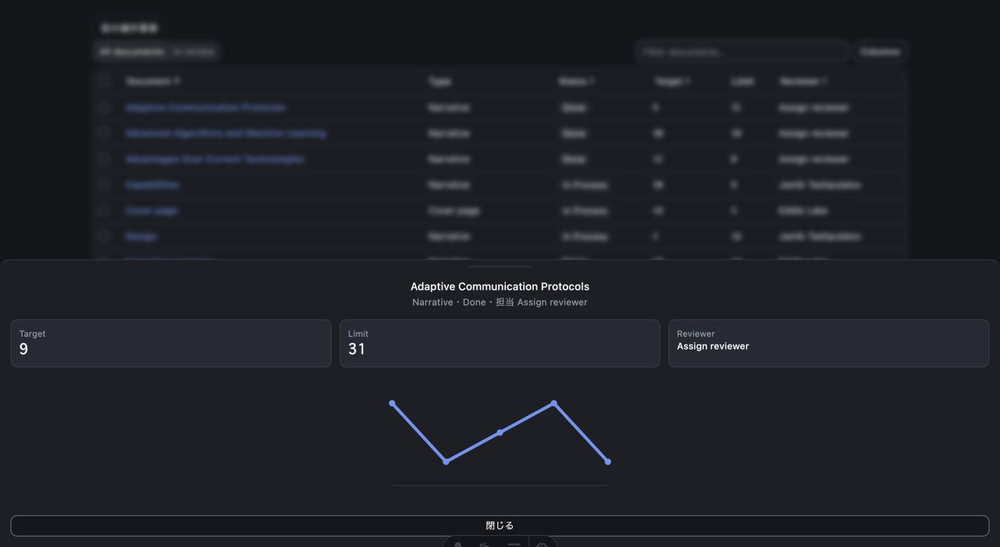

# 動作検証レポート: dashboard-table preview 修正後再検証

verified_impl_sha: 6441e12efe9e2ca6eaa5a456c93d4d9f0ff00e37

- 判定: **✅ PASS**
- 対象:
  - `/preview/dashboard-table/`
  - `/preview/dashboard-table-dark/`
- 実測URL: `http://127.0.0.1:4322`
- viewport: `1512 × 828`
- ブラウザ: Chrome `151.0.0.0`

## 成功基準

- accessible name付きDocument buttonからdrawerを開ける。
- light / darkともChartContainer・SVG・polylineが正寸法。
- strokeが可視で、画面上で折れ線と5点を識別できる。
- Document / Target sortが双方向に動く。
- 部分選択がheader mixed状態と件数へ同期する。
- DnDの依存・handler・affordanceがなく、drag / keyboard操作で行順が変わらない。
- duplicate ID、console error、page exception、HTTP error、request failureが0。

## 結果

| ケース | light | dark | 判定 |
|---|---|---|---|
| accessible Document button | 1件・可視 | 1件・可視 | ✅ |
| drawer open | 成功 | 成功 | ✅ |
| ChartContainer rect | `1480 × 192` | `1480 × 192` | ✅ |
| SVG rect | `1480 × 192` | `1480 × 192` | ✅ |
| polyline rect | `326.400 × 88.568` | `326.400 × 88.568` | ✅ |
| stroke | `rgb(47,95,209)` / `4px` / opacity 1 | `rgb(110,147,240)` / `4px` / opacity 1 | ✅ |
| circles | 5 | 5 | ✅ |
| screenshot視認 | 線・5点を識別 | 線・5点を識別 | ✅ |
| duplicate ID | 0 | 0 | ✅ |
| HTTP 4xx/5xx | 0 | 0 | ✅ |
| request failure | 0 | 0 | ✅ |
| page exception | 0 | 0 | ✅ |

lightは追加1500ms後にも以下を維持した。

- ChartContainer: `1480 × 192`
- SVG: `1480 × 192`
- polyline: `326.400 × 88.568`
- stroke width: `4px`
- opacity: `1`

## sort

Document:

- 初期: `11,10,12,6,1,5,3,8,7,9,2,4`
- descending: `4,2,9,7,8,3,5,1,6,12,10,11`
- 再操作で初期ascendingへ復帰。
- `aria-sort`も `descending` → `ascending`。

Target:

- ascending: `5,9,11,3,12,1,7,6,8,4,2,10`
- descending: `10,2,4,8,6,7,1,12,3,11,9,5`
- 完全な逆順。

## selection

- 1行選択後、header `aria-checked="mixed"`。
- `data-indeterminate=""`。
- 表示: `12 件を表示・1 件を選択`。
- root `data-selected-rows="1"`。

## DnD非搭載

- `draggable=true`: 0
- sortable attribute: 0
- drag handle: 0
- grab affordance: 0
- DnD import / handler source scan: 0
- pointer drag前後の行順: 不変
- `Control+ArrowDown` / `Control+ArrowUp`後の行順: 不変

## 通信・実行時エラー

| ページ | response観測値 | truncated | HTTP error | failure | exception |
|---|---:|---|---:|---:|---:|
| light | 137 | false | 0 | 0 | 0 |
| dark | 137 | false | 0 | 0 | 0 |

console error: 0

## evidence

- `evidence/case01-dashboard-table-light-chart.jpg`
- `evidence/2026-08-22-dashboard-table-light.jpg`
- `evidence/2026-08-22-dashboard-table-dark.jpg`
- `evidence/case08-browser-results.json`
- `evidence/case09-network-console-audit.json`
- `evidence/case10-dnd-static-scan.log`

## 未検証

- 非数値metricsのfallback。
- 検索結果0件。
- `In review` tab。
- Columns menu。
- 全行選択。
- 実行中のprops data差し替え。

## クリーンアップ

- 対象server停止済み。
- port 4322のLISTEN残留なし。
- 永続データ変更なし。
