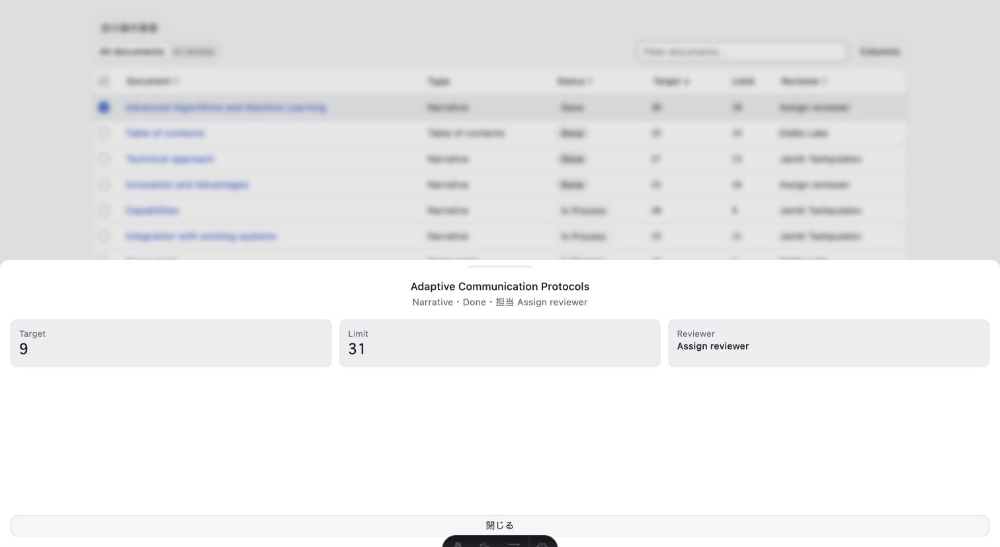
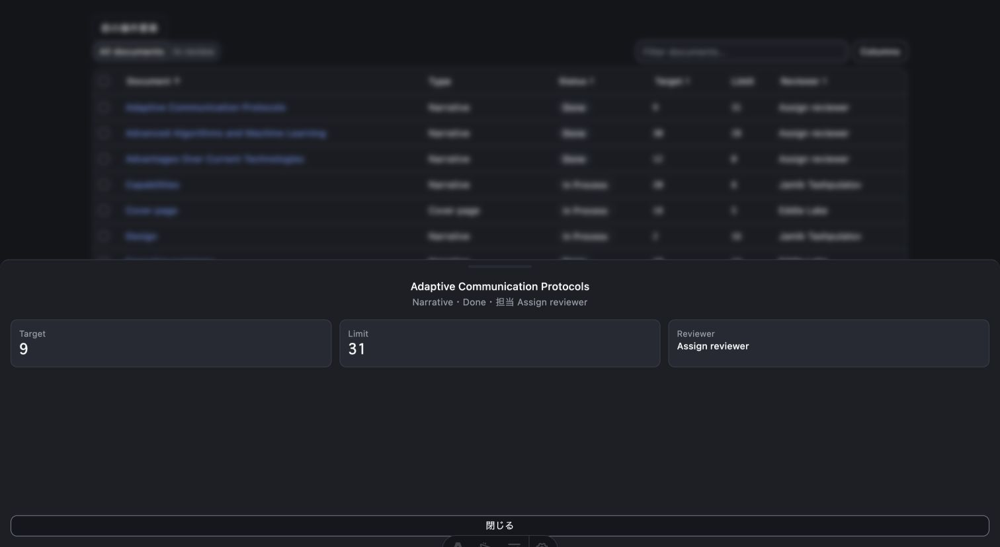

# 動作検証レポート: registry:block Phase 3 R3 実ブラウザ再検証

verified_impl_sha: 6b61a15c01a5d97d99e8c2558cfd4d0e7187c63a
- 総合判定: **❌ FAIL**
- 主要因: `dashboard-table` drawer 内 chart の SVG が light / dark とも `0 × 0` となり、折れ線と点が画面に表示されない。

## 実行環境（再現性の前提）

- 検証日時: 2026-08-22 13:22–13:37 JST
- 対象コミット: `6b61a15c01a5d97d99e8c2558cfd4d0e7187c63a`
- OS: Darwin 25.3.0 / arm64
- Node.js: `v26.7.0`
- npm: `11.19.0`
- ブラウザ: Chrome `151.0.0.0`
- 通常 viewport: `1512 × 828`、devicePixelRatio `2`
- mobile viewport: `390 × 844`
- 起動コマンド: `npm run dev -- --host 127.0.0.1 --port 4321`
- 指定ポート 4321 は別 worktree の `serve dist` が使用中だったため、対象 worktree の Astro が自動割当した `http://127.0.0.1:4322` を実測に使用した。
- 検証終了後に対象 Astro server PID 25458 を停止。`lsof -nP -iTCP:4322 -sTCP:LISTEN` は exit 1 で LISTEN 残留なし。
- 実行可否: ✅実行した。ただし chart 可視性の必須条件が不合格。

## 成功基準（rubric・実行前に定義）

- accessible name 付き Document button から drawer を開ける。
- light / dark の chart で SVG・polyline の `getBoundingClientRect()` がともに正の width / height を持つ。
- chart の stroke が可視で、スクリーンショット上でも折れ線と点を識別できる。
- Document / Target sort の実操作で行順が変わり、再操作で逆順になる。
- 部分選択時、header checkbox が `mixed` / indeterminate となり、表示選択件数と同期する。
- DnD 用依存・handler・affordance・`draggable=true` がなく、pointer drag 相当・keyboard 操作後にも行順が変わらない。
- dashboard-01 light / dark、catalog、mobile sidebar が実際に描画・操作できる。
- 安定描画後の duplicate DOM id、console error、page exception、HTTP 4xx/5xx、request failure が0件。
- 件数は今回の観測値としてのみ記録し、将来の固定成功条件にはしない。

## テストケースと結果

| # | 動作パターン | 導出元 | 技法 | リスク | 判定 | 再現率 | 実体エビデンス | 再現手順 |
|---|---|---|---|---|---|---|---|---|
| 1 | light の accessible Document button から drawer を開く | コード・画面 | 0スイッチ状態遷移 | High | ✅実測確認 | 1/1 | `case08-browser-results.json` | `/preview/dashboard-table/` を開き「Adaptive Communication Protocols の詳細を開く」をクリック |
| 2 | light drawer chart の SVG / polyline 寸法と画面表示 | コード・画面 | 境界値・再実行 | High | ❌不具合 | 2/2 | `case01-dashboard-table-light-chart.jpg`、`case02-dashboard-table-light-chart-retry.jpg`、`case08-browser-results.json` | drawer を開き、初回と1500ms後に SVG / polyline の rect と computed style を採取 |
| 3 | dark の accessible Document button と chart | コード・画面 | テーマ同値分割 | High | ❌不具合 | 1/1 | `case03-dashboard-table-dark-chart.jpg`、`case08-browser-results.json` | `/preview/dashboard-table-dark/` で同じ Document button をクリック |
| 4 | Document header sort の昇順・降順 | コード・画面 | 状態遷移 | High | ✅実測確認 | 1/1 | `case08-browser-results.json` | 「Document で並べ替える」を2回クリック |
| 5 | Target header sort の昇順・降順 | コード・画面・型 | 状態遷移・数値境界 | High | ✅実測確認 | 1/1 | `case08-browser-results.json` | 「Target で並べ替える」を2回クリック |
| 6 | 1行のみ選択したときの header mixed 状態 | コード・画面 | 部分集合境界 | High | ✅実測確認 | 1/1 | `case08-browser-results.json` | 「Advanced Algorithms and Machine Learning を選択」をクリック |
| 7 | DnD の静的不在 | コード・画面 | 否定条件監査 | High | ✅実測確認 | 1/1 | `case10-dnd-static-scan.log`、`case08-browser-results.json` | DnD import / handler を `rg` し、DOMの属性・affordanceを数える |
| 8 | pointer drag 相当操作後の行順 | 画面 | 異常操作 | High | ✅実測確認 | 1/1 | `case08-browser-results.json` | 先頭行中央から4行目中央へ pointer drag |
| 9 | keyboard reorder 相当操作後の行順 | 画面 | キーボード異常操作 | High | ✅実測確認 | 1/1 | `case08-browser-results.json` | 先頭 Document button へ `Control+ArrowDown`、`Control+ArrowUp` |
| 10 | dashboard-01 light / dark 表示 | コード・画面 | テーマ同値分割 | Medium | ✅実測確認 | 2/2 | `case04-dashboard-01-light.jpg`、`case05-dashboard-01-dark.jpg` | 各 preview URL を開き、root・見出し・カード・chart SVG を確認 |
| 11 | mobile sidebar の開閉 | コード・画面 | 1スイッチ状態遷移 | High | ✅実測確認 | 1/1 | `case06-dashboard-01-mobile-sidebar-open.jpg`、`case08-browser-results.json` | viewportを390×844にし、sidebar triggerをクリック後、Escapeで閉じる |
| 12 | catalog 内の dashboard-01 / dashboard-table | コード・画面 | 統合シナリオ | Medium | ✅実測確認 | 1/1 | `case07-catalog-dashboard-items.jpg`、`case08-browser-results.json` | `/catalog/` を開き対象2 preview の実在と正の rect を確認 |
| 13 | 安定描画後の duplicate DOM id | 画面 | 再実行 | High | ✅実測確認（注記あり） | 2/2 | `case08-browser-results.json` | catalog をreloadし、各回3000ms後に全 `[id]` を集計 |
| 14 | HTTP・request failure・console・pageerror | 画面・通信 | 異常系監査 | High | ✅実測確認 | 1 run | `case09-network-console-audit.json` | 全URL遷移中に CDP Network / Runtime events と console error を収集 |

判定ラベル: ✅実測確認 / ⚠️未確認・要人間判断 / 🔁flaky / ⏭️未実行 / ❌不具合

## 主要実測値

### chart 不具合

light / dark とも次の構造だった。

- `ChartContainer` (`data-slot="chart"`): `1480 × 192`
- `.recharts-responsive-container`: `1480 × 192`
- 直下 wrapper: inline style `width: 0px; height: 0px; overflow: visible;`
- SVG:
  - 属性: `width="100%" height="100%" viewBox="0 0 320 160"`
  - computed: `display:block; width:0px; height:0px; overflow:hidden`
  - rect: `0 × 0`
- polyline:
  - rect: `272 × 73.806...`
  - light stroke: `rgb(47, 95, 209)` / `4px` / opacity `1`
  - dark stroke: `rgb(110, 147, 240)` / `4px` / opacity `1`
- circle: 5個、個々の rect は `8 × 8`
- SVG が `overflow:hidden` の0寸法なので、polyline / circle は存在してもスクリーンショット上では表示されない。
- light は1500ms後も SVG `0 × 0` のまま。light 2/2、dark 1/1 で再現した。

### sort

Document:

- 初期: `11,10,12,6,1,5,3,8,7,9,2,4`
- descending: `4,2,9,7,8,3,5,1,6,12,10,11`
- 再操作 ascending: 初期順へ復帰
- `aria-sort`: `descending` → `ascending`

Target:

- ascending: `5,9,11,3,12,1,7,6,8,4,2,10`
- descending: `10,2,4,8,6,7,1,12,3,11,9,5`
- 2配列は完全な逆順。

### mixed selection

- 選択行: `Advanced Algorithms and Machine Learning`
- header checkbox:
  - `aria-checked="mixed"`
  - `data-indeterminate=""`
- status: `12 件を表示・1 件を選択`
- root `data-selected-rows="1"`

### DnD 非搭載

- `draggable=true`: 0
- sortable attribute: 0
- drag handle: 0
- grab affordance: 0
- `@dnd-kit` / `DndContext` / `SortableContext` / `useSortable` / `onDrag`: 0
- pointer drag 前後の行ID順: 不変
- keyboard操作前後の行ID順: 不変

### dashboard-01 / mobile / catalog

- dashboard-01 light / dark:
  - root: 各1
  - `Documents` heading: 各1
  - section card: 各5
  - chart root / SVG: 各1
  - data record count: 今回の観測値 `68`
- mobile:
  - open前の可視 sidebar: 0
  - open後: `292.5 × 844`
  - close後の dialog / 可視 sidebar: 0
- catalog:
  - catalog root: 1
  - preview item: 今回の観測値 `89`
  - dashboard-01: 1
  - dashboard-table: 1
  - `sidebar-13` の既存 `SettingsDialog` は source 上 `useState(true)` で起動時に開くため、対象 screenshot は dialog を閉じた後に採取した。

### エラー監査

- 観測 response: `374`
- HTTP 4xx / 5xx: 0
- request failure: 0
- `Runtime.exceptionThrown`: 0
- console error: 0
- stable duplicate DOM id:
  - dashboard-table light / dark: 0
  - dashboard-01 light / dark / mobile: 0
  - catalog の3000ms安定後再実行: 0、0
- catalog 初回 hydration 中の1200ms地点で `base-ui-_r1R_52a_` が一時的に2件と観測されたが、追加1000ms後に1件へ解消し、reload後の安定確認2/2では重複なし。過渡状態として evidence に残した。

## 三方向導出のクロスチェック結果

- コードから:
  - `SortState`、選択集合、drawer open state、chart数値変換、DnD不在を列挙した。
  - `DetailChart` は SVG / polyline / circle を明示的に生成する。
- 画面から:
  - Document button、sort buttons、checkbox、drawer、mobile sidebar triggerをa11y treeから確認した。
- 型から:
  - `DashboardTableRow` の `target` / `limit` は文字列で、chart描画時に数値変換される。
- クロスチェックで検出した乖離:
  - コードとa11y treeには chart SVGが存在するが、画面では不可視。
  - 原因となる差は `ChartContainer` の正寸法と、その内部 wrapper / SVG の0寸法。
- 画面から入力できるがコードで検証していない値:
  - 今回の必須ケース内ではなし。
- スキーマにあるがコードで扱っていないパラメータ:
  - 今回の対象範囲ではなし。

## 未到達分岐（網羅の穴・機械的な証拠）

次は今回の必須ケースから到達していない。

- `target` / `limit` が非数値のときの chart fallback表示。
- 検索結果0件の empty row。
- `In review` tabによる絞り込み。
- Columns menuによる列表示切替。
- 全行選択・全解除。
- propsの `data` が実行中に差し替わった場合の selection / active drawer reconcile。
- dashboard-01 chart の7日・30日・90日切替。
- network offline、resource timeout、JavaScript無効。

## 発見した不具合

### BUG-R3-01: dashboard-table drawer chart が表示されない

- 期待:
  - SVG / polyline が正の寸法を持ち、light / dark 双方で折れ線と点が見える。
- 実際:
  - `ChartContainer` と ResponsiveContainer は正寸法だが、その内側 wrapper と SVG が `0 × 0`。
  - SVG は `overflow:hidden` で、内部 polyline / circle がクリップされる。
  - light / dark screenshot とも chart領域が空白。
- 再現率:
  - light 2/2、dark 1/1。
- 再現手順:
  1. `npm run dev -- --host 127.0.0.1 --port 4321`
  2. `/preview/dashboard-table/` または `/preview/dashboard-table-dark/` を開く。
  3. 「Adaptive Communication Protocols の詳細を開く」をクリック。
  4. chart領域を目視し、`svg[aria-label="Target と limit の推移"]` の rect / computed styleを取得する。
- evidence:
  - `evidence/case01-dashboard-table-light-chart.jpg`
  - `evidence/case02-dashboard-table-light-chart-retry.jpg`
  - `evidence/case03-dashboard-table-dark-chart.jpg`
  - `evidence/case08-browser-results.json`

## 未列挙・未検証の残（正直な限界）

- 上記の未到達分岐は未検証。
- catalog hydration 中に一時観測した duplicate ID は安定状態では再現しなかった。過渡状態の影響評価は未実施。
- catalog screenshot は既存 `sidebar-13` dialog を閉じた後の状態。
- 4321 は無関係な既存 server が占有していたため、対象commitの実測URLは4322。空いている環境では指定どおり4321で再実行可能。

## クリーンアップ

- 対象 Astro dev server PID 25458 を停止。
- port 4322 の LISTEN残留なし。
- 検証用の永続データ作成なし。
- 外部送信・deploy・削除なし。
- worktreeへの追加は指定された新規 evidence 10ファイルのみ。
